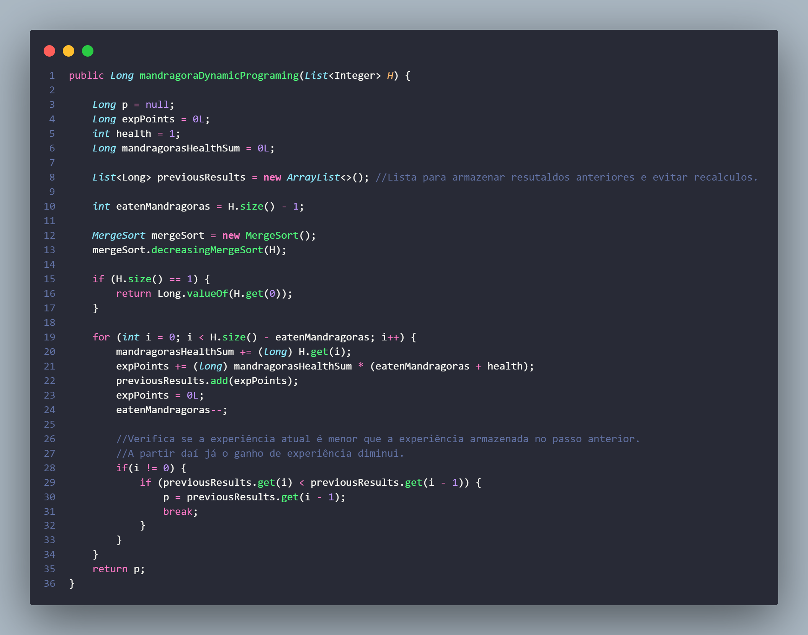
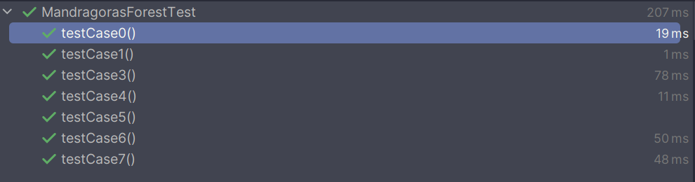
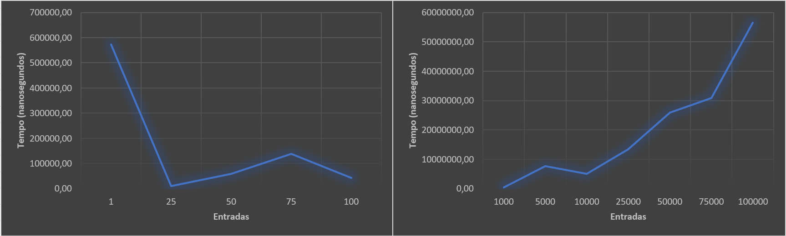

# Madragoras Forest HackerRank Problem

---
O espaço de trabalho contém duas pastas por padrão, onde:

- `scr/main/java`: pacote com classes Main, MandragorasForest e MargeSort
- `scr/test/java`: pacote de testes com as classes InputsReader e MandragorasForestTest
- `scr/test/java/inputs`: pacote com arquivos .txt contendo as entradas para os testes

- `maven/dependencies`: JUnit 5.10.1

- `Como executar`: executar a classe MandragorasForestTest. A classe executa um série de testes de validação do método implementado. 

## Sobre o Exercício

---
Este exercício descreve uma jornada através de uma floresta perigosa, onde Garnet e seu animal de estimação 
encontram mandrágoras. Cada mandrágora tem um certo nível de saúde, representado por uma lista H. Garnet 
começa com 1 ponto de saúde (s) e 0 pontos de experiência (p).

A cada encontro com uma mandrágora, Garnet tem duas opções:

1. O animal de estimação de Garnet come a mandrágora, aumentando s em 1 ponto e derrota a mandrágora.
2. O animal de estimação de Garnet batalha com a mandrágora, o que aumenta p em s vezes o valor de saúde (H) da mandrágora e derrota a mandrágora.

O objetivo é determinar o número máximo de pontos de experiência que Garnet pode coletar em sua jornada, 
dado um conjunto de mandrágoras com diferentes níveis de saúde.

### Restrições

- Número de mandragoras (n): **1 <= n <= 100000**
- Saúde das Mandragoras H[i]: **1 <= H[i] <= 10000000, 1<= i <= n onde**

### Exemplo prático
Se a lista de saúde das mandrágoras for **H = [3, 2, 5]**, Garnet tem duas escolhas para cada mandrágora. 
Uma possibilidade seria Garnet comer todas as três mandrágoras, resultando em nenhum ponto de experiência. 
Outra possibilidade seria Garnet comer as duas primeiras mandrágoras para ter **1 + 2 + 3 = 6** pontos de saúde e, 
em seguida, batalhar com a terceira mandrágora para ganhar **3 * 5 = 15** pontos de experiência. Neste exemplo, 
a melhor opção seria comer a mandrágora com 2 pontos de saúde e batalhar com as outras, resultando 
em **2 * (3 + 5) = 16** pontos de experiência

## Resolvendo o Exercício 

---
O método usa a técnica de programação dinâmica para otimizar o cálculo dos pontos de experiência, armazenando
resultados anteriores e verificando se continuar o cálculo é vamtajoso em termos de pontuação de experiência.

1. **Variáveis Iniciais**: O método começa inicializando variáveis como ***expPoints*** para acumular os pontos de experiência, 
***mandragorasHealthSum*** para acumular a soma da saúde das mandrágoras, e ***previousResults*** para armazenar os resultados anteriores.

2. **Ordenação**: As mandrágoras são ordenadas em ordem decrescente.

3. **Caso Base**: Se houver apenas uma mandrágora, o valor dela é retornado imediatamente.

4. **Loop Principal**: O método entra em um ***loop*** que percorre as mandrágoras. Para cada mandrágora, acumula a saúde, 
calcula os pontos de experiência, e armazena os resultados anteriores.

5. **Otimização**: Uma verificação é feita para determinar se o resultado atual é menor que o anterior. Se sim, atualiza ***p*** e 
encerra o ***loop***, economizando tempo computacional.

6. **Resultado Final**: O método retorna o valor de ***p***, que representa a melhor pontuação de experiência obtida com a abordagem dinâmica.

## Método implementado

---
O método ***mandragoraDynamicPrograming*** é projetado para calcular a pontuação máxima de experiência ao enfrentar 
uma série de mandrágoras durante a jornada. Ele utiliza a técnica de programação dinâmica para otimizar o cálculo, 
evitando recálculos desnecessários e armazenando resultados intermediários.

### 1 Inicialização das variáveis:
* ***p***: Variável que armazenará o resultado final da pontuação de experiência.
* ***expPoints***: Variável para armazenar temporariamente a pontuação de experiência durante o cálculo.
* ***health***: Representa a saúde inicial da personagem.
* ***mandragorasHealthSum***: Armazena a soma acumulada das saúdes das mandrágoras.
* ***previousResults***: Lista que armazenará os resultados intermediários para evitar recalculos.
* ***eatenMandragoras***: Representa a quantidade de mandrágoras comidas durante a jornada.

### 2 Ordenação Decrescente das Mandrágoras:
* Utiliza o algoritmo Mergesort para ordenar a lista ***H*** em ordem decrescente. 
Isso garante que as mandrágoras com maiores saúdes estejam no início da lista.

### 3 Caso base (se H tiver apenas uma mandrágora):
* Verifica se há apenas uma mandrágora na lista. Se for o caso, retorna imediatamente a 
saúde dessa mandrágora como pontuação de experiência.

### 4 Iteração sobre as mandrágoras (loop principal):
* Itera sobre as mandrágoras da lista ***H*** começando pelas de maior saúde.
* Acumula a saúde da mandrágora atual em ***mandragorasHealthSum***.
* Calcula a pontuação de experiência temporária (***expPoints***).
* Adiciona ***expPoints*** à lista ***previousResults***.
* Reseta **_expPoints_** para zero e decrementa **_eatenMandragoras_**.

### 5 Verificação de Otimização (Evitar Recálculos Desnecessários):
* Verifica se a pontuação de experiência atual é menor que a pontuação armazenada no passo anterior. Se for, 
isso indica que continuar o cálculo não resultará em uma pontuação maior, e o método interrompe a execução, 
retornando a pontuação armazenada.

### 6 Retorno do Resultado Final:
* Retorna a pontuação final armazenada em **_p_**.

---

Esse método utiliza a estratégia de otimização de programação dinâmica, evitando recálculos desnecessários 
e armazenando resultados intermediários. O uso da ordenação decrescente das mandrágoras permite que o 
algoritmo otimize a escolha entre comer ou enfrentar cada mandrágora, maximizando a pontuação de experiência 
total.

## Análise assintótica

---
### 1 Criação e listas e variáveis:
A criação de variáveis e listas é uma operação de tempo constante, portanto, é ***O(1)***.

### 2 Ordenação com MergeSort decrescente:
Para a ordenação decrescente do Array ***H*** foi utilizado o método ***decreasingMergeSort*** que
implementa o algoritmo **Mergesort** para ordenação decrescente. A complexidade de tempo do Mergesort 
é ***O(n log n)***, onde ***n*** é o tamanho da lista ***H***.

### 3 Loop principal:
O *loop* percorre a lista ***H*** uma vez. Sendo assim, a complexidade de tempo do *loop* é
***O(n)***, onde ***n*** é o tamanho da lista ***H***. As demais operações realizadas dentro do
*loop* são executadas em tempo constante, com complexidade ***O(1)***. No pior caso, o *loop* percorre
a lista ***H*** ***n*** vezes.

### Complexidade do método ***mandragoraDynamicPrograming***:
A ordenação com o MergeSort domina a complexidade do método. O restante das operações são realizados em
tempo constante ou são proporcionais ao tamanho da lista. Portante a complexidade do mátodo é ***O(n log n)***.

## Testes Realizados

---
Foi implementada a classe de testes ***MandragorasForestTest*** contendo 7 casos de testes propostos
pelo portal HackerHank. Os testes variam em números de entradas. Para entradas maiores, os valores
são lidos de arquivos txt. A classe responsável pela leitura das entradas é a ***InputsReader***.

### Resultados:

### Tempo de execução:

Foram implementados testes para verificação do tempo de execução do método ***MandragorasForestTest***
para diferentes tamanhos de entradas, iniciando em ***n = 1** até ***n = 100.000***. Os testes foram execuatados
em duas máquina diferentes:
* **Máquina Um**: Intel Core i7 8700K 3.7 GHz / 32 GBytes RAM DDR4 3.200 MHz
* **Máquina Dois**: Intel Core i5 9300H 2.4 GHz / 8 GBytes RAM DDR4 2.600 MHz

| Entradas | Tempo médio (nanosegundos)  Máquina Um | Tempo médio (nanosegundos)  Máquina Dois |
|----------|:------------------------------------------:|:--------------------------------------------:|
| 01       |                   573480                   |                   1059533                    |
| 25       |                   10575                    |                    15633                     |
| 50       |                   58275                    |                    96700                     |
| 75       |                   139250                   |                    169700                    |
| 100      |                   43249                    |                    50766                     |
| 1.000    |                   464225                   |                    505566                    |
| 5.000    |                  7697524                   |                   14747500                   |
| 10.000   |                  5067100                   |                   5178633                    |
| 25.000   |                  13457350                  |                   13723433                   |
| 50.000   |                  25938175                  |                   28836633                   |
| 75.000   |                  30850400                  |                   37374433                   |
| 100.000  |                  56454300                  |                   56023433                   |

Segue abaixo gráficos elçaborados para os dados da Máquina Um.
O primeiro gráfico mostra a evolução do tempo de execução para entradas
de 01 a 100. O segundo mostra o tempo de 1.000 entradas até 100.000.

## Submit Result

---
A submissão do método para calcular o máximo de pontos de experiência possível atingiu um *score* de **50** pontos no portal ***HackerHank***.

## Referências

---
ref.1: CORMEN, Thoma; LEISERSON, Charles; RIVEST, Ronald; STEIN, Clifford. Algorítimos: Teoria e Prática. Rio de
Janeiro: GEN | Grupo Editorial Nacional. Publicado pelo selo LTC | Livros Técnicos e Científicos Editora Ltda, 2022.

ref.2: JUNIT.ORG. Junit 5 User Guide. Diponível em: <https://junit.org/junit5/docs/current/user-guide/>.
Acesso em: 02 dez. 2023.

ref.3: HACKERRANK. Mandragora Prblem. Disponível em: <https://www.hackerrank.com/challenges/mandragora/problem>. Acesso em: 01 dez. 2023.

